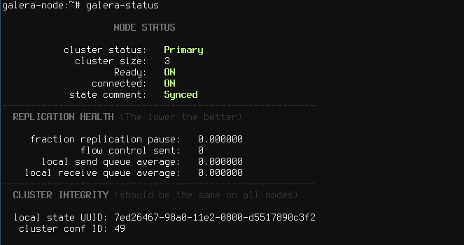

galera-status
=============

status and health of a Galera cluster

    USAGE: galera-status [--help] [--batch] [MySQL options]

    OPTIONS: --help        this help
             --batch       all WSREP variables (output not formatted, no colors)

You can pass MySQL options. By default mysql will use config files, see 'mysql --help' and http://dev.mysql.com/doc/refman/5.5/en/option-files.html 

# Screenshot

